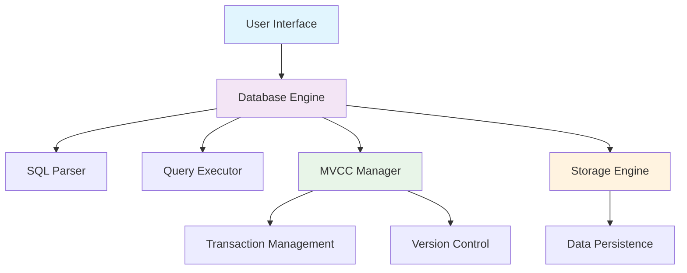
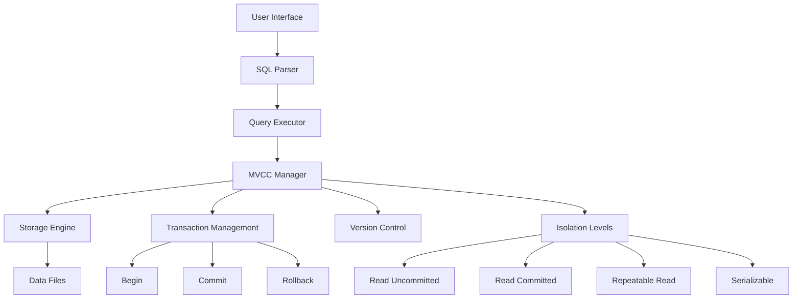

#  SQL MVCC Engine

A comprehensive Database Management System with Multi-Version Concurrency Control (MVCC) implementation in Python, featuring a modern web-based UI.

## 🚀 Features

### Core Database
- **SQL Parser**: Supports CREATE, SELECT, INSERT, UPDATE, DELETE operations
- **Transaction Management**: BEGIN, COMMIT, ROLLBACK support
- **Data Persistence**: Automatic saving and loading of database state

### MVCC Implementation
- **Multi-Version Concurrency Control**: Maintains multiple versions of records
- **Transaction Isolation**: READ UNCOMMITTED, READ COMMITTED, REPEATABLE READ, SERIALIZABLE
- **Version Control**: Track record versions with transaction visibility
- **Concurrent Access**: Safe concurrent read/write operations
- **Rollback Support**: Automatic cleanup of aborted transactions

### Modern UI
- **Streamlit-based Interface**: Clean, responsive web UI
- **Query Editor**: Syntax-highlighted SQL editor with history
- **Schema Explorer**: Visual table structure and data browser
- **Performance Analytics**: Query performance monitoring and charts
- **Concurrency Demo**: Interactive MVCC demonstration

## 🛠️ Installation

### Quick Start
```bash
# Clone or download the project
git clone <repository-url>
cd sql_mvcc_engine

# Run setup script
python setup.py

# Start the application
streamlit run ui/enhanced_app.py

```
## 📁 Project Structure

```
sql_mvcc_engine/
├──  README.md                      
├──  main.py                            
├──  setup.py                           
├──  config.py                          
├──  requirements.txt                   
├──  engine/                            
│   ├──  README.md                     
│   ├──  __init__.py                   
│   ├──  database.py                    
│   ├──  parser.py                     
│   ├──  executor.py                    
│   ├──  mvcc.py                        
│   ├──  storage.py                     
│   └──  mvcc_enhanced.py               
│
├──  ui/                                
│   ├──  README.md                      
│   ├──  __init__.py                   
│   ├──  app.py                         
│   └──  enhanced_app.py              
│
├──  utils/                            
│   ├──  README.md                    
│   ├──  __init__.py                
│   └──  helpers.py                     
│
├──  data/                              
│   └──  README.md                      
│
├──  logs/                             
│   └──  README.md                     
│
└──  exports/                           
    └──  README.md                     
```

---

#  SQL MVCC Engine - Main Documentation

##  Overview

A comprehensive Database Management System with **Multi-Version Concurrency Control (MVCC)** implementation in Python, featuring a modern web-based interface for learning and experimenting with database internals.



##  Key Features

###  Core Database Engine
- **SQL Parser**: Supports CREATE, SELECT, INSERT, UPDATE, DELETE, DROP operations
- **Transaction Management**: BEGIN, COMMIT, ROLLBACK with ACID properties
- **Data Persistence**: Automatic saving/loading of database state

###  MVCC Implementation
- **Multi-Version Concurrency Control**: Maintains multiple record versions
- **Transaction Isolation**: READ UNCOMMITTED, READ COMMITTED, REPEATABLE READ, SERIALIZABLE
- **Non-blocking Operations**: Readers don't block writers
- **Version Control**: Track record history with transaction visibility

### 🎨 Modern Web Interface
- **React-based UI**: Modern, responsive web application
- **Query Editor**: SQL editor with query execution
- **Schema Explorer**: Visual table structure browser
- **Performance Analytics**: Real-time query analytics and charts
- **Transaction Management**: Full transaction control with isolation levels
- **🆕 Live Transaction Tree**: Git-like visualization showing transaction branching and merging
  - Visual tree/graph showing transaction relationships
  - Branch out when transactions start
  - Merge together when transactions commit
  - Real-time updates via WebSocket

## 🚀 Quick Start

### Prerequisites
- Python 3.7 or higher
- 500MB free disk space
- Modern web browser

### Installation

**Option 1: Automated Setup**
```bash
# Clone the repository
git clone <repository-url>
cd sql_mvcc_engine

# Run setup script (recommended)
python setup.py
```

**Option 2: Manual Installation**
```bash
# Install dependencies
pip install streamlit pandas plotly numpy prettytable pygments

# Or from requirements file
pip install -r requirements.txt
```

### Running the Application

**React Frontend with Transaction Tree (Recommended):**

1. Start the backend:
```bash
cd backend
pip install -r requirements.txt
python main.py
```
Backend will run at `http://localhost:8000`

2. Start the frontend (in a new terminal):
```bash
cd frontend
npm install
npm run dev
```
Frontend will open at `http://localhost:5173`

**Legacy Streamlit UI:**
```bash
streamlit run ui/enhanced_app.py
```
The Streamlit UI will open at `http://localhost:8501`

##  Basic Usage

### First Steps
1. **Create a table:**
   ```sql
   CREATE TABLE users (id INT, name VARCHAR, email VARCHAR, age INT)
   ```

2. **Insert data:**
   ```sql
   INSERT INTO users (id, name, email, age) VALUES (1, 'Alice', 'alice@email.com', 30)
   ```

3. **Query data:**
   ```sql
   SELECT * FROM users WHERE age > 25
   ```

4. **Use transactions:**
   ```sql
   BEGIN TRANSACTION
   UPDATE users SET age = 31 WHERE name = 'Alice'
   COMMIT
   ```

### MVCC Demonstration
```sql
-- Session 1
BEGIN TRANSACTION
UPDATE users SET age = 35 WHERE name = 'Alice'

-- Session 2 (different browser tab)
SELECT * FROM users  -- Still sees old age due to MVCC isolation

-- Session 1
COMMIT  -- Now Session 2 can see the change
```

##  Architecture



## 📚 Documentation Index

- **[Transaction Tree Guide](./TRANSACTION_TREE_GUIDE.md)** - 🌳 Git-like visualization guide
- **[Engine Documentation](./engine/README.md)** - Core database engine details
- **[UI Documentation](./ui/README.md)** - User interface features and usage
- **[Utilities Documentation](./utils/README.md)** - Helper functions and tools
- **[Data Storage Documentation](./data/README.md)** - Data persistence details
<!-- - **[Logs Documentation](./logs/README.md)** - Logging and monitoring
- **[Exports Documentation](./exports/README.md)** - Data export features -->

##  Configuration

Modify `config.py` to customize:

```python
# Database settings
DATABASE_NAME = "mvcc_database"
MAX_TABLE_SIZE = 100000

# MVCC settings  
DEFAULT_ISOLATION_LEVEL = "READ_COMMITTED"
MAX_CONCURRENT_TRANSACTIONS = 100

# UI settings
QUERY_HISTORY_SIZE = 1000
MAX_DISPLAY_RECORDS = 1000
```

## 🎯 Use Cases

###  Education
- Learn SQL fundamentals
- Understand database internals
- Experiment with transaction isolation levels
- Study MVCC implementation

###  Development
- Test SQL queries safely
- Prototype database schemas
- Debug transaction issues
- Benchmark query performance

###  Research
- Experiment with concurrency control algorithms
- Test isolation level behaviors
- Analyze database performance characteristics

##  Contributing

We welcome contributions! Please see:
1. Fork the repository
2. Create a feature branch
3. Submit a pull request
4. Follow the code style guidelines

##  Troubleshooting

### Common Issues

**Application won't start:**
```bash
# Check Python version
python --version

# Reinstall dependencies
pip install -r requirements.txt

# Try different port
streamlit run ui/enhanced_app.py --server.port 8502
```

**Query errors:**
- Check SQL syntax
- Verify table exists
- Remove trailing semicolons
- Check for unclosed quotes

**MVCC not working:**
- Verify transaction is active
- Check isolation level settings
- Restart the application

<!-- ## 📄 License

This project is licensed under the MIT License - see the LICENSE file for details. -->

##  Acknowledgments

- Built with Python and Streamlit
- Inspired by PostgreSQL MVCC implementation
- Educational focus on database internals

---

## 🔗 Quick Links

- [**Engine Documentation**](./engine/README.md) - Core database components
- [**UI Documentation**](./ui/README.md) - Interface features and usage  
- [**Getting Started Guide**](#quick-start) - Installation and basic usage
- [**SQL Command Reference**](./engine/README.md#sql-command-reference) - Supported SQL syntax

---

**Ready to explore?** Start with the [Engine Documentation](./engine/README.md) to understand the core components, or jump right in by [running the application](#quick-start)! 🚀

---