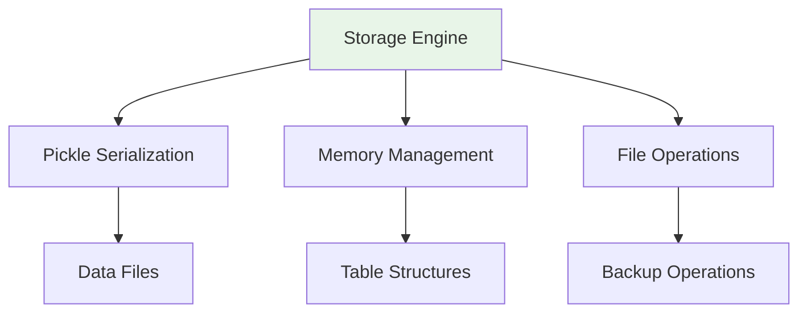

#  Data Storage Documentation

## Overview
Data persistence layer for the SQL MVCC Engine, handling table storage, record management, and file operations.

## Architecture



## Storage Structure

### Directory Layout
```
data/
├── database.pkl              
├── backup_20240115_103000.pkl 
└── export_20240115_103000.json 
```

### File Formats

#### Pickle Format (.pkl)
**Binary serialization** of Python objects for efficient storage.

**Structure:**
```python
{
    'tables': {
        'users': {
            'columns': ['id', 'name', 'email'],
            'records': {
                1: {'id': 1, 'name': 'Alice', ...},
                2: {'id': 2, 'name': 'Bob', ...}
            },
            'created_at': '2024-01-15T10:30:00'
        }
    },
    'next_ids': {
        'users': 3,
        'products': 5
    }
}
```

#### JSON Export Format (.json)
**Human-readable export** for data migration and inspection.

**Structure:**
```json
{
    "export_timestamp": "2024-01-15T10:30:00",
    "tables": {
        "users": {
            "columns": ["id", "name", "email"],
            "records": [
                {"id": 1, "name": "Alice", "email": "alice@email.com"},
                {"id": 2, "name": "Bob", "email": "bob@email.com"}
            ]
        }
    }
}
```

## Storage Engine

### Core Class: `StorageEngine`

**Initialization:**
```python
storage = StorageEngine(data_dir="data")
```

**Key Methods:**

#### Table Management
- `create_table(name, columns)` - Create new table
- `table_exists(name)` - Check table existence
- `get_table_names()` - List all tables
- `drop_table(name)` - Remove table

#### Record Operations
- `insert_record(table, record)` - Add record
- `get_all_records(table)` - Retrieve all records
- `update_record(table, record_id, record)` - Modify record
- `delete_record(table, record_id)` - Remove record

#### ID Management
- `get_next_id(table)` - Generate sequential IDs
- Automatic ID tracking per table

### Data Persistence

#### Automatic Saving
```python
def _save_data(self):
    """Save current state to disk"""
    with open("data/database.pkl", "wb") as f:
        pickle.dump({
            'tables': self.tables,
            'next_ids': self.next_ids
        }, f)
```

#### Automatic Loading
```python
def _load_data(self):
    """Load saved state from disk"""
    if os.path.exists("data/database.pkl"):
        with open("data/database.pkl", "rb") as f:
            data = pickle.load(f)
            self.tables = data.get('tables', {})
            self.next_ids = data.get('next_ids', {})
```

## MVCC Data Structure

### Record with MVCC Metadata
```python
{
    # User data
    'id': 1,
    'name': 'Alice',
    'email': 'alice@email.com',
    'age': 30,
    
    # MVCC metadata
    '_mvcc_created_txn': 5,
    '_mvcc_created_ts': '2024-01-15T10:30:00',
    '_mvcc_deleted_txn': None
}
```

### Table Structure
```python
table_structure = {
    'users': {
        'columns': ['id', 'name', 'email', 'age'],
        'records': {
            1: { ... },  # Record with MVCC metadata
            2: { ... },  # Another record
            # ... more records
        },
        'created_at': '2024-01-15T10:30:00'
    }
}
```

## Performance Considerations

### Memory Management
- **Lazy loading** - Data loaded on first access
- **Efficient indexing** - Direct record access by ID
- **Batch operations** - Multiple records processed together

### File I/O Optimization
- **Binary serialization** - Faster than text formats
- **Incremental saves** - Only on data modification
- **Error recovery** - Continue after file errors

### Large Dataset Handling
- **Record limits** - Configurable maximum records per table
- **Memory monitoring** - Warn on high memory usage
- **Cleanup operations** - Remove old versions automatically

## Backup and Recovery

### Automated Backups
```python
def create_backup(self):
    """Create timestamped backup"""
    timestamp = datetime.now().strftime("%Y%m%d_%H%M%S")
    backup_file = f"data/backup_{timestamp}.pkl"
    # ... backup logic
```

### Recovery Options
1. **Automatic recovery** on startup errors
2. **Manual backup restoration**
3. **Data export/import** via JSON

### Export Features
```python
def export_to_json(self, filename):
    """Export database to JSON format"""
    export_data = {
        'export_timestamp': datetime.now().isoformat(),
        'tables': {}
    }
    # ... export logic
```

## Security Considerations

### Data Validation
- **Input sanitization** - Prevent injection attacks
- **Type checking** - Ensure data integrity
- **Size limits** - Prevent resource exhaustion

### File Security
- **Path validation** - Prevent directory traversal
- **Permission checks** - Ensure proper file access
- **Error handling** - Graceful failure on permission issues

## Migration and Upgrades

### Version Compatibility
- **Forward compatibility** - New versions read old data
- **Migration scripts** - Update old data formats
- **Backup creation** - Before any migration

### Data Export for Migration
```bash
# Export current data
python -c "from engine.storage import StorageEngine; s = StorageEngine(); s.export_to_json('migration.json')"
```

## Monitoring and Maintenance

### Storage Metrics
- **Table counts** - Number of tables
- **Record counts** - Records per table
- **File sizes** - Storage usage
- **Backup status** - Backup file information

### Maintenance Tasks
1. **Regular backups** - Automated or manual
2. **Storage cleanup** - Remove old backup files
3. **Integrity checks** - Verify data consistency
4. **Performance optimization** - Rebuild indexes if needed

## Troubleshooting

### Common Issues

**File Permission Errors:**
```python
# Check directory permissions
import os
print(os.access("data", os.W_OK))  # Should be True
```

**Corrupted Data Files:**
```python
# Attempt recovery from backup
storage = StorageEngine()
if storage.corrupted:
    storage.restore_from_backup()
```

**Storage Limits:**
- Monitor disk space
- Implement record limits
- Use data archiving

### Recovery Procedures

1. **Check recent backups**
2. **Attempt automatic recovery**
3. **Manual restoration from backup**
4. **Data export/import if needed**

---

**Next:** [Engine Documentation](../engine/README.md) | [UI Documentation](../ui/README.md) | [Main Documentation](../README.md)