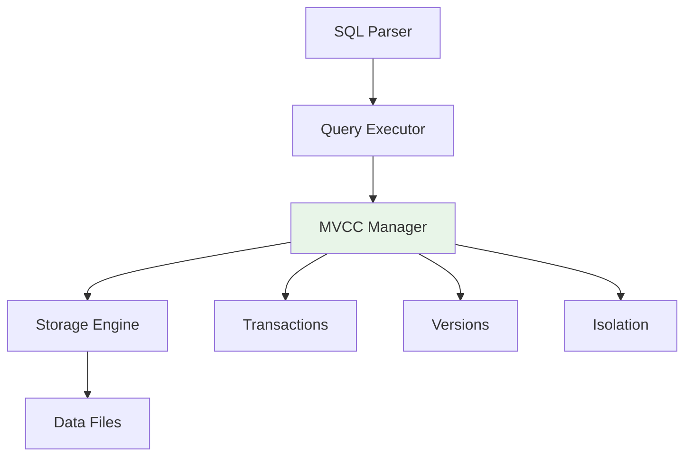

#  Database Engine Documentation

## Overview
The core database engine implementing SQL parsing, query execution, MVCC, and storage management.

## Architecture



## Core Components

### 1. Database Class (`database.py`)
**Main coordinator** that ties all components together.

**Key Methods:**
- `execute(query, txn_id)` - Execute SQL queries
- `begin_transaction()` - Start new transaction
- `commit_transaction(txn_id)` - Commit transaction
- `rollback_transaction(txn_id)` - Rollback transaction

**Usage:**
```python
from engine.database import Database

db = Database("my_database")
result = db.execute("SELECT * FROM users")
```

### 2. SQL Parser (`parser.py`)
**Translates SQL strings** into executable command structures.

**Supported SQL:**
```sql
CREATE TABLE users (id INT, name VARCHAR)
SELECT * FROM users WHERE age > 25
INSERT INTO users (id, name) VALUES (1, 'Alice')
UPDATE users SET age = 30 WHERE name = 'Alice'
DELETE FROM users WHERE id = 1
DROP TABLE users
BEGIN TRANSACTION
COMMIT
ROLLBACK
```

**Output Structure:**
```python
{
    'type': 'SELECT',
    'table_name': 'users', 
    'columns': ['*'],
    'where': 'age > 25'
}
```

### 3. Query Executor (`executor.py`)
**Executes parsed queries** with MVCC awareness.

**Key Features:**
- Transaction-aware query execution
- MVCC record visibility filtering
- WHERE clause evaluation
- Result set generation

**Method Flow:**
```python
_execute_select()   # Handle SELECT queries
_execute_insert()   # Handle INSERT queries  
_execute_update()   # Handle UPDATE queries
_execute_delete()   # Handle DELETE queries
_execute_create()   # Handle CREATE TABLE
_execute_drop()     # Handle DROP TABLE
```

### 4. MVCC Manager (`mvcc.py`)
**Implements Multi-Version Concurrency Control**.

**Key Concepts:**
- **Record Versions**: Multiple versions of each record
- **Transaction Visibility**: Which records each transaction can see
- **Isolation Levels**: Different consistency guarantees

**Visibility Rules:**
- Records visible if created by committed transactions
- Records not visible if deleted by committed transactions
- Current transaction sees its own changes

**Isolation Levels:**
- `READ_UNCOMMITTED` - See uncommitted changes
- `READ_COMMITTED` - Only see committed changes (default)
- `REPEATABLE_READ` - Snapshot isolation
- `SERIALIZABLE` - Strictest isolation

### 5. Storage Engine (`storage.py`)
**Manages data persistence** and table operations.

**Data Structure:**
```python
tables = {
    'users': {
        'columns': ['id', 'name', 'age'],
        'records': {
            1: {'id': 1, 'name': 'Alice', 'age': 30, '_mvcc_created_txn': 1},
            2: {'id': 2, 'name': 'Bob', 'age': 25, '_mvcc_created_txn': 1}
        },
        'created_at': '2024-01-15T10:30:00'
    }
}
```

**Key Methods:**
- `create_table(name, columns)` - Create new table
- `insert_record(table, record)` - Add record to table
- `get_all_records(table)` - Retrieve all records
- `drop_table(table)` - Remove table and data
- `table_exists(table)` - Check if table exists

## MVCC Implementation Details

### Record Structure with MVCC Metadata
```python
{
    'id': 1,
    'name': 'Alice',
    'age': 30,
    # MVCC Metadata
    '_mvcc_created_txn': 5,      # Transaction that created this version
    '_mvcc_created_ts': '2024-01-15T10:30:00',
    '_mvcc_deleted_txn': None    # Transaction that deleted this version
}
```

### Transaction Management
```python
# Begin transaction
txn_id = mvcc.begin_transaction("READ_COMMITTED")

# Get visible records (respects isolation level)
visible_records = mvcc.get_visible_records("users", txn_id)

# Commit makes changes permanent
mvcc.commit_transaction(txn_id)

# Rollback discards changes
mvcc.rollback_transaction(txn_id)
```

### Enhanced MVCC Features (`mvcc_enhanced.py`)
**Advanced isolation level support** with snapshot capabilities.

**Snapshot Isolation:**
- Creates database snapshot at transaction start
- Provides consistent view for REPEATABLE_READ and SERIALIZABLE
- Prevents phantom reads and non-repeatable reads

## SQL Command Reference

### Data Definition Language (DDL)
```sql
CREATE TABLE table_name (column1 TYPE, column2 TYPE, ...)
DROP TABLE table_name
```

### Data Manipulation Language (DML)  
```sql
INSERT INTO table_name (col1, col2) VALUES (val1, val2)
SELECT col1, col2 FROM table_name WHERE condition
UPDATE table_name SET col1 = val1 WHERE condition
DELETE FROM table_name WHERE condition
```

### Transaction Control
```sql
BEGIN TRANSACTION
COMMIT
ROLLBACK
```

## Error Handling

**Common Exceptions:**
- `ValueError` - Invalid SQL syntax or parameters
- `KeyError` - Table or record not found
- `RuntimeError` - Transaction conflicts or MVCC violations

**Example:**
```python
try:
    result = db.execute("SELECT * FROM non_existent_table")
except ValueError as e:
    print(f"Error: {e}")
```

## Testing

Run engine tests:
```bash
python -m pytest tests/engine/ -v
```

## Dependencies

- **Standard Library**: `re`, `threading`, `datetime`, `json`, `pickle`
- **No external dependencies** for core engine functionality

---

**Next:** [UI Documentation](../ui/README.md) | [Main Documentation](../README.md)