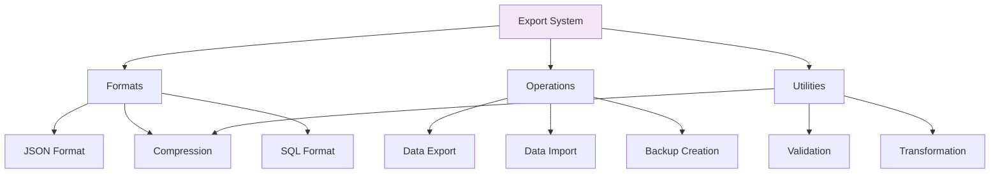

#  Exports Documentation

## Overview
Data export and import functionality for the SQL MVCC Engine, enabling data migration, backup, and integration with other systems.

## Architecture



## Export Formats

### 1. JSON Format (.json)
**Primary export format** for full database backup and migration.

**Structure:**
```json
{
    "export_metadata": {
        "version": "1.0",
        "export_timestamp": "2024-01-15T10:30:00",
        "database_name": "mvcc_database",
        "record_count": 150
    },
    "tables": {
        "users": {
            "schema": {
                "columns": ["id", "name", "email", "age"],
                "created_at": "2024-01-15T09:00:00"
            },
            "data": [
                {
                    "id": 1,
                    "name": "Alice",
                    "email": "alice@email.com",
                    "age": 30
                },
                {
                    "id": 2,
                    "name": "Bob", 
                    "email": "bob@email.com",
                    "age": 25
                }
            ]
        }
    }
}
```

### 2. CSV Format (.csv)
**Table-specific exports** for spreadsheet applications and data analysis.

**Example users.csv:**
```csv
id,name,email,age
1,Alice,alice@email.com,30
2,Bob,bob@email.com,25
3,Charlie,charlie@email.com,35
```

### 3. SQL Format (.sql)
**Executable SQL scripts** for importing into other database systems.

**Example export.sql:**
```sql
-- SQL Export from MVCC Engine
-- Export time: 2024-01-15 10:30:00

CREATE TABLE users (
    id INT,
    name VARCHAR,
    email VARCHAR, 
    age INT
);

INSERT INTO users (id, name, email, age) VALUES (1, 'Alice', 'alice@email.com', 30);
INSERT INTO users (id, name, email, age) VALUES (2, 'Bob', 'bob@email.com', 25);
INSERT INTO users (id, name, email, age) VALUES (3, 'Charlie', 'charlie@email.com', 35);
```

## Export Operations

### Full Database Export
```python
def export_full_database(format='json'):
    """Export entire database with all tables and data"""
    export_data = {
        'metadata': generate_export_metadata(),
        'tables': {}
    }
    
    for table_name in self.get_table_names():
        export_data['tables'][table_name] = {
            'schema': self.get_table_schema(table_name),
            'data': self.get_table_data(table_name)
        }
    
    return export_data
```

### Table-Specific Export
```python
def export_table(table_name, format='json'):
    """Export specific table with schema and data"""
    if not self.table_exists(table_name):
        raise ValueError(f"Table {table_name} does not exist")
    
    return {
        'metadata': generate_export_metadata(),
        'table': {
            'name': table_name,
            'schema': self.get_table_schema(table_name),
            'data': self.get_table_data(table_name)
        }
    }
```

### Selective Data Export
```python
def export_with_query(query, format='json'):
    """Export data based on SQL query results"""
    result = self.execute_query(query)
    return {
        'metadata': generate_export_metadata(),
        'query': query,
        'data': result['data']
    }
```

## Import Operations

### JSON Import
```python
def import_from_json(file_path):
    """Import database from JSON export file"""
    with open(file_path, 'r') as f:
        import_data = json.load(f)
    
    # Validate import data
    self.validate_import_data(import_data)
    
    # Import tables and data
    for table_name, table_data in import_data['tables'].items():
        self.import_table(table_name, table_data)
```

### CSV Import
```python
def import_csv_to_table(table_name, csv_file_path):
    """Import CSV data into existing table"""
    if not self.table_exists(table_name):
        raise ValueError(f"Table {table_name} does not exist")
    
    with open(csv_file_path, 'r') as f:
        reader = csv.DictReader(f)
        for row in reader:
            self.insert_record(table_name, row)
```

## Export Utilities

### Metadata Generation
```python
def generate_export_metadata():
    """Generate comprehensive export metadata"""
    return {
        'export_version': '1.0',
        'export_timestamp': datetime.now().isoformat(),
        'database_name': self.database_name,
        'mvcc_engine_version': '1.0.0',
        'total_tables': len(self.get_table_names()),
        'total_records': self.get_total_record_count()
    }
```

### Data Validation
```python
def validate_export_data(export_data):
    """Validate export data structure and integrity"""
    required_keys = ['metadata', 'tables']
    for key in required_keys:
        if key not in export_data:
            raise ValueError(f"Missing required key: {key}")
    
    # Validate table structures
    for table_name, table_data in export_data['tables'].items():
        self.validate_table_structure(table_name, table_data)
```

### Format Conversion
```python
def convert_to_csv(export_data, table_name):
    """Convert JSON export data to CSV format"""
    table_data = export_data['tables'][table_name]
    csv_output = []
    
    # Header row
    headers = table_data['schema']['columns']
    csv_output.append(','.join(headers))
    
    # Data rows
    for record in table_data['data']:
        row = [str(record.get(col, '')) for col in headers]
        csv_output.append(','.join(row))
    
    return '\n'.join(csv_output)
```

## File Management

### Export Directory Structure
```
exports/
├── full_backup_20240115_103000.json
├── users_export_20240115_103000.csv
├── products_export_20240115_103000.csv
├── migration_script_20240115_103000.sql
└── archive/
    ├── full_backup_20240114_103000.json
    └── users_export_20240114_103000.csv
```

### Naming Conventions
- **Full backups**: `full_backup_YYYYMMDD_HHMMSS.format`
- **Table exports**: `tablename_export_YYYYMMDD_HHMMSS.format`
- **Query exports**: `query_export_YYYYMMDD_HHMMSS.format`
- **Migration files**: `migration_YYYYMMDD_HHMMSS.sql`

## Use Cases

### 1. Database Migration
```python
# Export from MVCC Engine
export_data = database.export_full_database('json')

# Import to another system
with open('migration.json', 'w') as f:
    json.dump(export_data, f, indent=2)
```

### 2. Data Analysis
```python
# Export specific table for analysis
users_data = database.export_table('users', 'csv')

# Use with pandas for analysis
import pandas as pd
df = pd.read_csv('users_export.csv')
print(df.describe())
```

### 3. Backup and Recovery
```python
# Automated nightly backup
def create_nightly_backup():
    timestamp = datetime.now().strftime("%Y%m%d_%H%M%S")
    filename = f"exports/full_backup_{timestamp}.json"
    database.export_full_database('json', filename)
```

### 4. Data Sharing
```python
# Export sanitized data for sharing
def export_public_data():
    # Remove sensitive fields
    export_data = database.export_full_database()
    for table in export_data['tables'].values():
        for record in table['data']:
            record.pop('email', None)
            record.pop('password', None)
    return export_data
```

## Security Considerations

### Data Sanitization
```python
def sanitize_export_data(export_data, sensitive_fields=None):
    """Remove sensitive fields from export data"""
    if sensitive_fields is None:
        sensitive_fields = ['password', 'email', 'ssn']
    
    sanitized_data = export_data.copy()
    for table_name, table_data in sanitized_data['tables'].items():
        for record in table_data['data']:
            for field in sensitive_fields:
                record.pop(field, None)
    
    return sanitized_data
```

### Access Control
- **Export permissions** based on user roles
- **Sensitive data filtering** for different user types
- **Export logging** for audit trails
- **Size limits** to prevent resource exhaustion

## Performance Optimization

### Large Dataset Handling
```python
def export_large_table_streaming(table_name, output_file):
    """Stream large tables to avoid memory issues"""
    with open(output_file, 'w') as f:
        # Write header
        f.write('[')
        
        first = True
        for record in self.stream_table_records(table_name):
            if not first:
                f.write(',')
            json.dump(record, f)
            first = False
        
        # Write footer
        f.write(']')
```

### Incremental Exports
```python
def export_incremental(since_timestamp):
    """Export only data modified since given timestamp"""
    modified_data = {}
    for table_name in self.get_table_names():
        recent_records = self.get_records_modified_after(
            table_name, since_timestamp
        )
        if recent_records:
            modified_data[table_name] = recent_records
    
    return modified_data
```

## Integration Features

### UI Export Interface
- **One-click exports** from the web interface
- **Format selection** dropdown
- **Progress indicators** for large exports
- **Download links** for completed exports

### API Endpoints
```python
# RESTful export endpoints
@app.route('/api/export/full')
def export_full_database_api():
    return jsonify(database.export_full_database())

@app.route('/api/export/table/<table_name>')
def export_table_api(table_name):
    return jsonify(database.export_table(table_name))
```

## Troubleshooting

### Common Export Issues

**Memory Errors:**
- Use streaming for large datasets
- Implement pagination for large exports
- Increase memory limits if needed

**Format Compatibility:**
- Validate export formats before processing
- Provide format conversion utilities
- Test imports with sample data

**Permission Issues:**
- Check file system permissions
- Validate user export privileges
- Implement proper error handling

### Export Validation
```python
def validate_export_file(file_path):
    """Validate export file integrity"""
    try:
        with open(file_path, 'r') as f:
            export_data = json.load(f)
        validate_export_data(export_data)
        return True
    except Exception as e:
        logger.error(f"Export validation failed: {e}")
        return False
```

---

**Next:** [Main Documentation](../README.md) | [Engine Documentation](../engine/README.md)