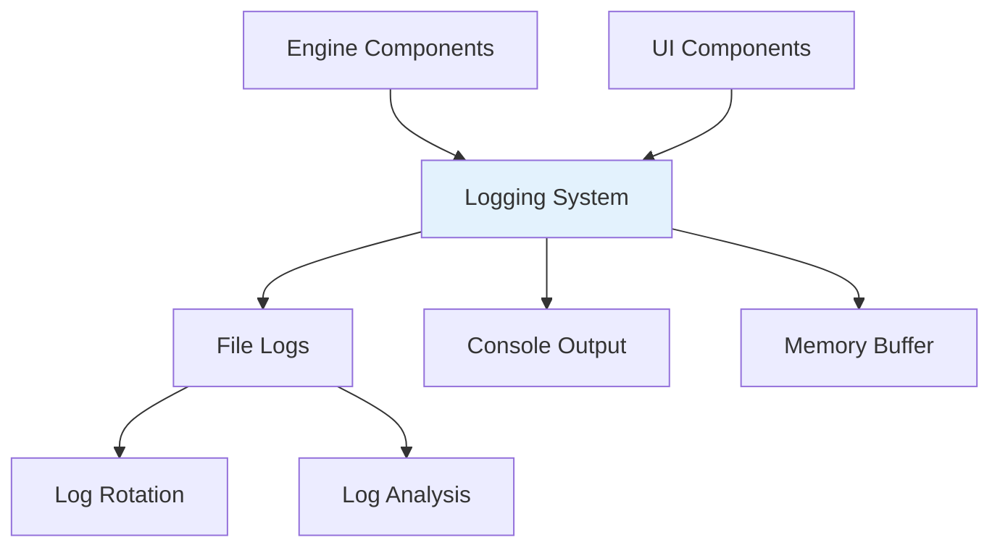

#  Logs Documentation

## Overview
Logging and monitoring system for the SQL MVCC Engine, providing insights into database operations, performance, and errors.

## Architecture



## Logging Structure

### Directory Layout
```
logs/
├── mvcc_engine.log          
├── performance.log          
├── errors.log               
└── archive/                
    ├── mvcc_engine.log.2024-01-15
    └── performance.log.2024-01-15
```

### Log Levels
- **DEBUG**: Detailed information for debugging
- **INFO**: General operational information
- **WARNING**: Warning messages for potential issues
- **ERROR**: Error events that might still allow operation
- **CRITICAL**: Critical errors that prevent operation

## Log Configuration

### Default Settings
```python
# In config.py
LOG_LEVEL = "INFO"
LOG_MAX_SIZE = 10 * 1024 * 1024  # 10MB
LOG_BACKUP_COUNT = 5
LOG_FORMAT = "%(asctime)s - %(name)s - %(levelname)s - %(message)s"
```

### Log File Management
- **Automatic rotation** when files reach size limits
- **Timestamped archives** for historical analysis
- **Compression** for older log files
- **Cleanup** of very old log files

## Log Categories

### 1. Query Execution Logs
**Records all SQL queries and their execution details**

**Example Log Entry:**
```
2024-01-15 10:30:15 - SQLExecutor - INFO - Executing: SELECT * FROM users
2024-01-15 10:30:15 - SQLExecutor - INFO - Query completed: 5 rows in 0.003s
2024-01-15 10:30:16 - SQLExecutor - ERROR - Table not found: non_existent_table
```

### 2. Transaction Logs
**Tracks transaction lifecycle and MVCC operations**

**Example Log Entry:**
```
2024-01-15 10:30:20 - MVCCManager - INFO - Transaction started: TXN-5 (READ_COMMITTED)
2024-01-15 10:30:21 - MVCCManager - DEBUG - TXN-5: Updated record users/1
2024-01-15 10:30:22 - MVCCManager - INFO - Transaction committed: TXN-5
```

### 3. Performance Logs
**Monitors query performance and system metrics**

**Example Log Entry:**
```
2024-01-15 10:30:25 - Performance - INFO - Query: SELECT * FROM users - Time: 0.003s
2024-01-15 10:30:26 - Performance - WARNING - Slow query: Complex JOIN - Time: 1.234s
```

### 4. Error Logs
**Captures errors and exceptions for debugging**

**Example Log Entry:**
```
2024-01-15 10:30:30 - ErrorHandler - ERROR - ValueError: Table 'users' already exists
2024-01-15 10:30:31 - ErrorHandler - CRITICAL - Storage corruption detected
```

## Log Analysis

### Performance Metrics
- **Query execution times**
- **Transaction durations**
- **Memory usage patterns**
- **Concurrent operation counts**

### Error Patterns
- **Frequent error types**
- **Error time distribution**
- **Recovery success rates**
- **User impact analysis**

### Usage Statistics
- **Most frequent queries**
- **Peak usage times**
- **Table access patterns**
- **Transaction success rates**

## Monitoring Features

### Real-time Monitoring
```python
# Example monitoring setup
class PerformanceMonitor:
    def log_query_performance(self, query, execution_time):
        if execution_time > 1.0:  # Slow query threshold
            self.logger.warning(f"Slow query: {query} - Time: {execution_time}s")
```

### Alert System
- **Slow query alerts** (> 1 second execution)
- **Error rate alerts** (high error frequency)
- **Resource alerts** (high memory/CPU usage)
- **Connection alerts** (too many concurrent users)

## Log Utilities

### Log Viewer
**Built-in log viewing capabilities in the UI:**
- Real-time log streaming
- Filter by log level
- Search through log entries
- Export log data

### Analysis Tools
```python
def analyze_logs(log_file):
    """Analyze log files for patterns and insights"""
    # Count error types
    # Calculate performance averages
    # Identify usage patterns
```

## Best Practices

### 1. Sensitive Data Protection
```python
# Don't log sensitive information
# BAD: logger.info(f"User password: {password}")
# GOOD: logger.info("User authentication attempted")
```

### 2. Appropriate Log Levels
```python
logger.debug("Detailed variable state")  # For debugging
logger.info("User performed action")     # Normal operations
logger.warning("Potential issue")        # Something unexpected
logger.error("Operation failed")         # Error that needs attention
```

### 3. Structured Logging
```python
# Use structured format for easier parsing
logger.info("Query executed", extra={
    'query': query,
    'execution_time': duration,
    'rows_affected': count
})
```

## Troubleshooting

### Common Log Issues

**Log File Too Large:**
- Enable log rotation
- Increase log level to reduce verbosity
- Archive and compress old logs

**Missing Log Entries:**
- Check log level settings
- Verify file permissions
- Ensure proper logger configuration

**Performance Impact:**
- Use asynchronous logging
- Reduce debug logging in production
- Implement log sampling for high-volume operations

### Log Analysis Commands
```bash
# Count errors in log file
grep -c "ERROR" logs/mvcc_engine.log

# Find slow queries
grep "Slow query" logs/performance.log

# Analyze log patterns by hour
awk '{print $2}' logs/mvcc_engine.log | cut -d: -f1 | sort | uniq -c
```

## Integration with UI

### Log Display in Web Interface
- **Real-time log viewer** in admin section
- **Performance dashboards** with charts
- **Error summary panels**
- **System health indicators**

### Export Features
- **Download log files** for analysis
- **Generate log reports** in PDF/CSV format
- **Email alerts** for critical errors
- **API access** for external monitoring

---

**Next:** [Exports Documentation](../exports/README.md) | [Main Documentation](../README.md)