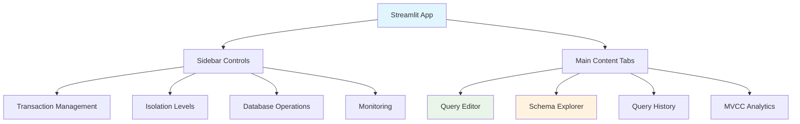
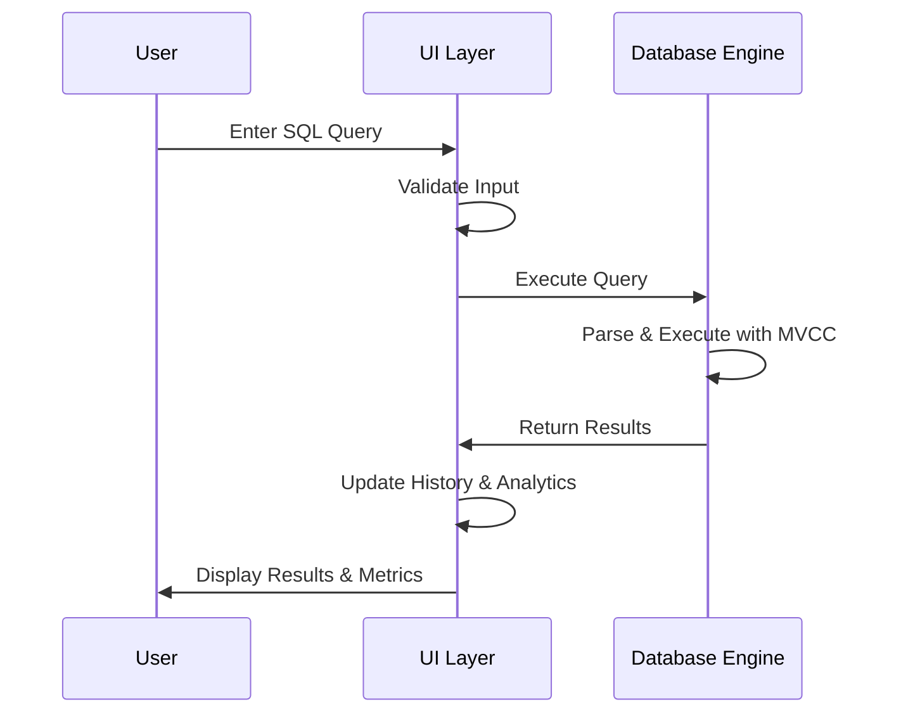

# User Interface Documentation

## Overview
Modern web-based interface built with Streamlit for interacting with the SQL MVCC Engine.

## Architecture



## Interface Components

### 1. Sidebar Controls

**Transaction Management:**
-  **BEGIN TXN** - Start new transaction
-  **COMMIT** - Commit active transaction  
-  **ROLLBACK** - Rollback active transaction
-  **Status** - View transaction details

**Isolation Level Selection:**
- READ UNCOMMITTED
- READ COMMITTED (default)
- REPEATABLE READ
- SERIALIZABLE

**Database Operations:**
-  **Refresh Schema** - Reload table information
-  **Clear History** - Clear query history
-  **DB Status** - View database status

**Monitoring:**
- Show Advanced MVCC Info toggle
- System Tables viewer

### 2. Main Content Tabs

#### 📝 Query Editor Tab
**Features:**
- Syntax-highlighted SQL editor
- One-click query templates
- Execution time tracking
- Result set display
- MVCC details expansion

**Quick Query Templates:**
- Create Users Table
- Create Products Table  
- Insert Sample Data
- Select with WHERE conditions
- Begin Transaction

####  Schema Explorer Tab
**Features:**
- Table selection dropdown
- Column information display
- Sample data preview (first 10 records)
- Table statistics
- MVCC metadata viewer

**Displayed Information:**
- Column names and types
- Record count
- Creation timestamp
- Sample record data

#### 📜 Query History Tab
**Features:**
- Chronological query history
- Success/failure status
- Execution time metrics
- Transaction context
- Filtering options

**Filter Options:**
- Show successful queries
- Show failed queries
- Limit to last 20 entries

####  MVCC Analytics Tab
**Features:**
- Execution time trends
- Query type distribution
- Success rate analytics
- Performance metrics

**Visualizations:**
- Line charts for execution times
- Pie charts for query distribution
- Bar charts for daily statistics
- Performance summary tables

## UI Components

### EnhancedSQLApp Class

**Key Methods:**
- `setup_sidebar()` - Configure sidebar controls
- `setup_main_content()` - Setup main tab interface
- `execute_query()` - Handle query execution
- `display_query_result()` - Show results and metrics

**Session State Management:**
```python
# Key session state variables
st.session_state.db = Database()           # Database instance
st.session_state.query_history = []        # Query history
st.session_state.active_transaction = None # Current transaction
st.session_state.show_advanced = False     # MVCC details toggle
```

### Query Execution Flow



## Styling and Themes

### Custom CSS
```css
.main-header {
    font-size: 2.5rem;
    color: #1f77b4;
    text-align: center;
}

.transaction-active {
    background: linear-gradient(45deg, #e8f5e8, #c8e6c9);
    border: 2px solid #4caf50;
}

.transaction-inactive {
    background: linear-gradient(45deg, #ffebee, #ffcdd2);
    border: 2px solid #f44336;
}
```

### Color Coding
-  **Success**: Green backgrounds with checkmarks
-  **Error**: Red backgrounds with X marks  
-  **Active**: Blue accents for active states
-  **Data**: Clean tables with alternating rows

## MVCC Demonstration Features

### Concurrency Demo Section
**Interactive demonstration** of MVCC in action:

**Features:**
- Multiple session simulation
- Real-time visibility differences
- Isolation level comparisons
- Commit/rollback scenarios

**Usage Example:**
1. Start Session 1 with transaction
2. Make changes in Session 1
3. Observe Session 2 cannot see changes
4. Commit in Session 1
5. See changes appear in Session 2

### Advanced MVCC Information
**Detailed MVCC metadata** when enabled:

**Displayed Information:**
- Transaction IDs and status
- Record version chains
- Isolation level effects
- Visibility rule applications

## Performance Considerations

### Query History Limits
- Maximum 1000 history entries
- Automatic pruning of old entries
- Efficient storage in session state

### Large Result Sets
- Limited to 1000 displayed records
- Pagination for very large results
- Performance warnings for slow queries

### Real-time Updates
- Live execution time tracking
- Progressive result loading
- Background analytics computation

## Browser Compatibility

**Supported Browsers:**
- Chrome/Chromium 80+
- Firefox 75+
- Safari 13+
- Edge 80+

**Required Features:**
- Modern JavaScript ES6+
- WebSocket support
- Local storage APIs
- CSS Grid/Flexbox

## Mobile Responsiveness

**Adaptive Layout:**
- Sidebar collapses on small screens
- Tab navigation becomes vertical
- Font sizes adjust automatically
- Touch-friendly button sizes

## Customization

### Theme Modification
```python
# In enhanced_app.py
st.set_page_config(
    page_title="Custom MVCC Engine",
    page_icon="🔍", 
    layout="wide",
    initial_sidebar_state="expanded"
)
```

### Adding New Query Templates
```python
templates = {
    "New Template": "YOUR_SQL_QUERY_HERE",
    # Add more templates here
}
```

## Troubleshooting

### Common UI Issues

**Streamlit Connection Errors:**
```bash
# Try different port
streamlit run ui/enhanced_app.py --server.port 8502

# Clear cache
streamlit cache clear
```

**Performance Issues:**
- Reduce query history size
- Limit displayed records
- Disable advanced analytics

**Display Problems:**
- Refresh browser page
- Clear browser cache
- Check browser console for errors

---

**Next:** [Engine Documentation](../engine/README.md) | [Utilities Documentation](../utils/README.md) | [Main Documentation](../README.md)