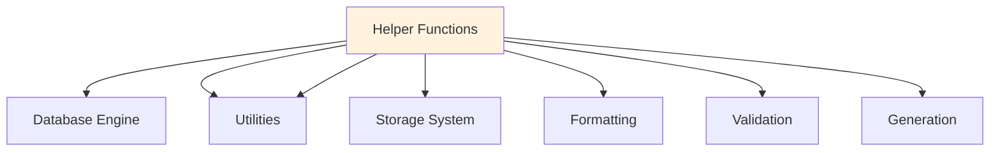

#  Utilities Documentation

## Overview
Helper functions and utility modules supporting the SQL MVCC Engine.

## Architecture



## Core Utilities

### Helper Functions (`helpers.py`)

#### 1. Formatting Utilities

**`format_timestamp(timestamp)`**
```python
# Converts ISO timestamp to readable format
input: "2024-01-15T10:30:00"
output: "2024-01-15 10:30:00"
```

**`format_query_result(result)`**
```python
# Formats query execution results for display
input: {'success': True, 'message': 'Query executed', 'affected_rows': 1}
output: "✅ Query executed (1 row(s) affected)"
```

#### 2. Validation Utilities

**`validate_sql_identifier(identifier)`**
```python
# Validates SQL table/column names
validate_sql_identifier("users")      # True
validate_sql_identifier("123table")   # False
validate_sql_identifier("user_name")  # True
```

**Validation Rules:**
- Must start with a letter
- Can contain letters, numbers, underscores
- No spaces or special characters
- Not empty

#### 3. Generation Utilities

**`generate_id(length=8)`**
```python
# Generates random IDs for records
generate_id(8)  # "A1b2C3d4"
generate_id(12) # "XyZ123AbC456"
```

**Characteristics:**
- Alphanumeric characters
- Case-sensitive
- Cryptographically random
- Configurable length

#### 4. Safety Utilities

**`safe_get(data, key, default=None)`**
```python
# Safely retrieve values from dictionaries
user = {'name': 'Alice', 'age': 30}
safe_get(user, 'name')     # 'Alice'
safe_get(user, 'email')    # None
safe_get(user, 'email', 'N/A')  # 'N/A'
```

## Usage Examples

### In Database Engine
```python
from utils.helpers import validate_sql_identifier, format_timestamp

def create_table(self, table_name):
    if not validate_sql_identifier(table_name):
        raise ValueError(f"Invalid table name: {table_name}")
    # ... create table logic
```

### In User Interface
```python
from utils.helpers import format_query_result, safe_get

def display_results(self, result):
    message = format_query_result(result)
    affected_rows = safe_get(result, 'affected_rows', 0)
    # ... display logic
```

### In Storage Engine
```python
from utils.helpers import generate_id

def insert_record(self, table_name, record):
    if 'id' not in record:
        record['id'] = generate_id()
    # ... insert logic
```

## Error Handling

### Graceful Failure
```python
try:
    formatted = format_timestamp(invalid_timestamp)
except Exception:
    formatted = "Invalid timestamp"
```

### Default Values
```python
# Instead of crashing, use safe defaults
user_count = safe_get(stats, 'user_count', 0)
last_update = safe_get(stats, 'last_update', 'Unknown')
```

## Performance Considerations

### Efficient String Operations
- Use f-strings for formatting
- Avoid unnecessary string copies
- Lazy evaluation where possible

### Memory Management
- Generators for large datasets
- Efficient data structures
- Proper cleanup of temporary objects

## Testing Utilities

### Test Data Generation
```python
def generate_test_user():
    return {
        'id': generate_id(),
        'name': 'Test User',
        'email': f'test_{generate_id(6)}@email.com',
        'age': random.randint(18, 65)
    }
```

### Validation Testing
```python
def test_sql_identifier_validation():
    assert validate_sql_identifier("users") == True
    assert validate_sql_identifier("123table") == False
    assert validate_sql_identifier("user_profile") == True
```

## Extension Guide

### Adding New Utilities

1. **Create function** in `helpers.py`:
```python
def new_utility_function(param1, param2):
    """Brief description of what it does."""
    # Implementation here
    return result
```

2. **Add to `__init__.py`**:
```python
from .helpers import new_utility_function
__all__ = [..., 'new_utility_function']
```

3. **Write tests** for the new function
4. **Update documentation** with usage examples

### Utility Categories

**String Utilities:**
- Text formatting
- Validation
- Transformation

**Data Utilities:**
- Type conversion
- Structure validation
- Serialization helpers

**Time Utilities:**
- Timestamp handling
- Duration calculation
- Date formatting

**Security Utilities:**
- Input sanitization
- Identifier validation
- Safe data access

## Best Practices

### 1. Keep Utilities Stateless
```python
# Good - stateless
def format_name(first, last):
    return f"{first} {last}"

# Avoid - stateful
class Formatter:
    def __init__(self):
        self.cache = {}
```

### 2. Provide Sensible Defaults
```python
def get_config_value(key, default=None):
    return config.get(key, default)
```

### 3. Handle Edge Cases
```python
def safe_divide(a, b):
    if b == 0:
        return 0
    return a / b
```

### 4. Document Assumptions
```python
def calculate_age(birth_date, current_date):
    """
    Calculate age in years.
    
    Assumes:
    - birth_date is before current_date
    - dates are in YYYY-MM-DD format
    """
    # Implementation
```

## Dependencies

**No external dependencies** - uses only Python standard library:
- `random` - ID generation
- `datetime` - Timestamp handling
- `string` - String constants

---

**Next:** [Engine Documentation](../engine/README.md) | [UI Documentation](../ui/README.md) | [Main Documentation](../README.md)
